# Theme gallery

Previews of every theme (channel list + chat view). Install: copy the URL, then add it by URL in Rain → Themes.

Regenerate with `python3 tools/gallery.py`.

- [Catppuccin Frappé](#catppuccin-frappe)
- [Catppuccin Macchiato](#catppuccin-macchiato)
- [Catppuccin Mocha](#catppuccin-mocha)
- [Dracula](#dracula)
- [Everforest Dark](#everforest-dark)
- [Gruvbox](#gruvbox)
- [Gruvbox Material Dark](#gruvbox-material-dark)
- [Kanagawa Dragon](#kanagawa-dragon)
- [Kanagawa Wave](#kanagawa-wave)
- [Librekai](#librekai)
- [Librekai Dimmed](#librekai-dimmed)
- [Librekai Refined](#librekai-refined)
- [Nord Frost](#nord-frost)
- [Nord Polar Night](#nord-polar-night)
- [Rosé Pine](#rose-pine)
- [Rosé Pine Moon](#rose-pine-moon)
- [Solarized Osaka](#solarized-osaka)
- [Tokyo Dark](#tokyodark)
- [Tokyo Night Moon](#tokyonight-moon)
- [Tokyo Night Night](#tokyonight-night)
- [Tokyo Night Storm](#tokyonight-storm)

<a id="catppuccin-frappe"></a>
## Catppuccin Frappé

*Frappé · accent: mauve*

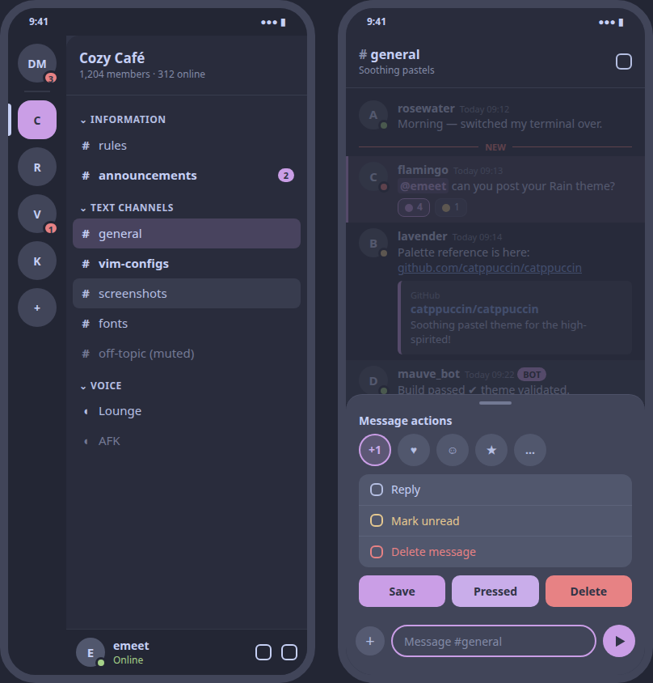

```
https://raw.githubusercontent.com/alpine-vortex/rain-themes/main/catppuccin-frappe/catppuccin-frappe.json
```
[Notes](catppuccin-frappe/catppuccin-frappe-notes.md) · [Spec](catppuccin-frappe/theme.spec.json)

<a id="catppuccin-macchiato"></a>
## Catppuccin Macchiato

*Macchiato · accent: mauve*

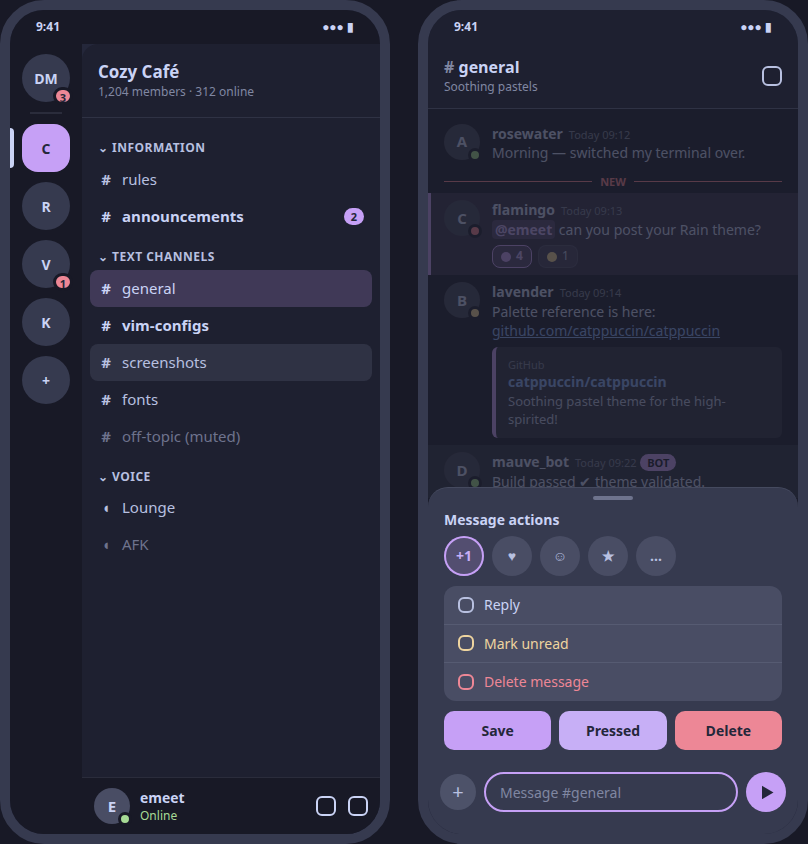

```
https://raw.githubusercontent.com/alpine-vortex/rain-themes/main/catppuccin-macchiato/catppuccin-macchiato.json
```
[Notes](catppuccin-macchiato/catppuccin-macchiato-notes.md) · [Spec](catppuccin-macchiato/theme.spec.json)

<a id="catppuccin-mocha"></a>
## Catppuccin Mocha

*Mocha · accent: mauve*

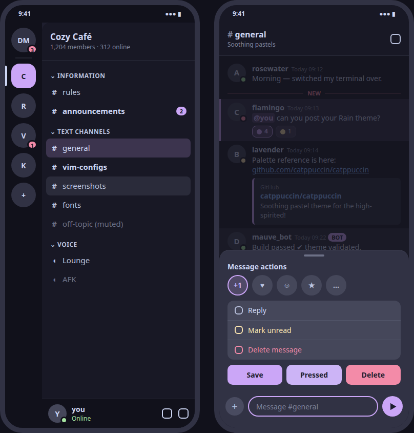

```
https://raw.githubusercontent.com/alpine-vortex/rain-themes/main/catppuccin-mocha/catppuccin-mocha.json
```
[Notes](catppuccin-mocha/catppuccin-mocha-notes.md) · [Spec](catppuccin-mocha/theme.spec.json)

<a id="dracula"></a>
## Dracula

*Dracula Classic (dark) · accent: purple*

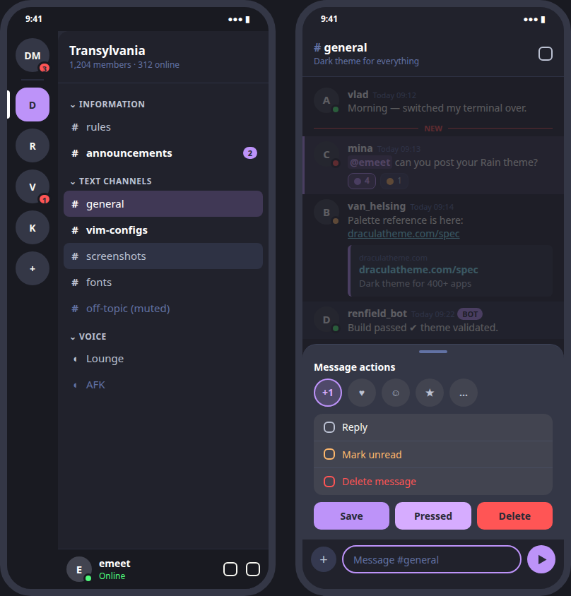

```
https://raw.githubusercontent.com/alpine-vortex/rain-themes/main/dracula/dracula.json
```
[Notes](dracula/dracula-notes.md) · [Spec](dracula/theme.spec.json)

<a id="everforest-dark"></a>
## Everforest Dark

*Dark · medium contrast · accent: green*

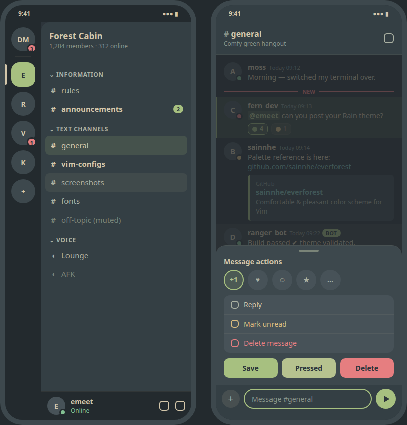

```
https://raw.githubusercontent.com/alpine-vortex/rain-themes/main/everforest-dark/everforest-dark.json
```
[Notes](everforest-dark/everforest-dark-notes.md) · [Spec](everforest-dark/theme.spec.json)

<a id="gruvbox"></a>
## Gruvbox

*Dark · medium contrast (default) · accent: bright orange*

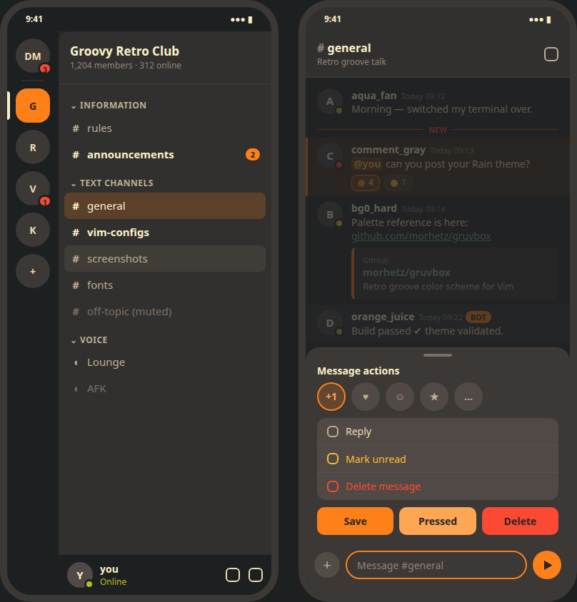

```
https://raw.githubusercontent.com/alpine-vortex/rain-themes/main/gruvbox/gruvbox.json
```
[Notes](gruvbox/gruvbox-notes.md) · [Spec](gruvbox/theme.spec.json)

<a id="gruvbox-material-dark"></a>
## Gruvbox Material Dark

*Dark · background medium · foreground material · accent: blue*

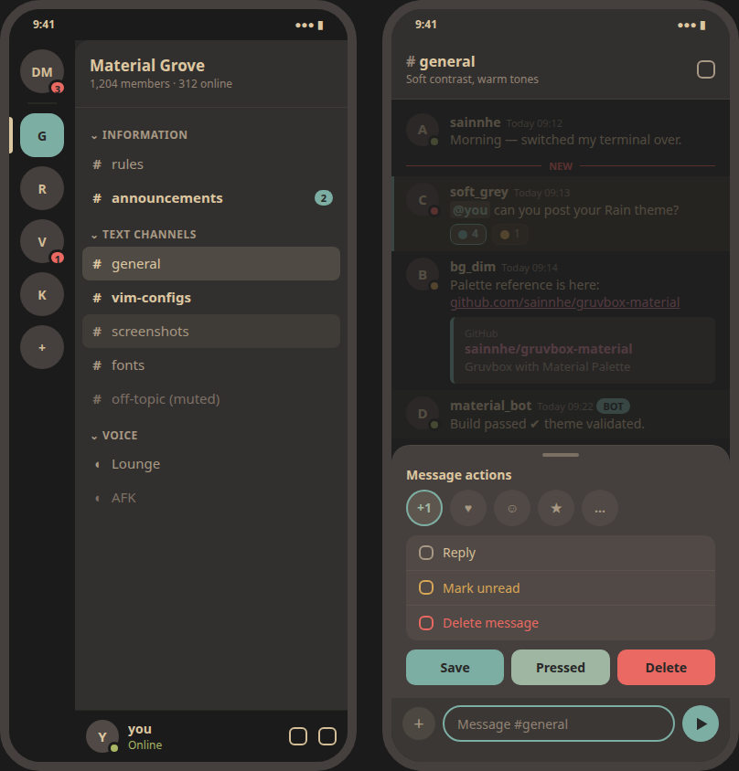

```
https://raw.githubusercontent.com/alpine-vortex/rain-themes/main/gruvbox-material-dark/gruvbox-material-dark.json
```
[Notes](gruvbox-material-dark/gruvbox-material-dark-notes.md) · [Spec](gruvbox-material-dark/theme.spec.json)

<a id="kanagawa-dragon"></a>
## Kanagawa Dragon

*Dragon (dark, muted) · accent: dragonBlue2*

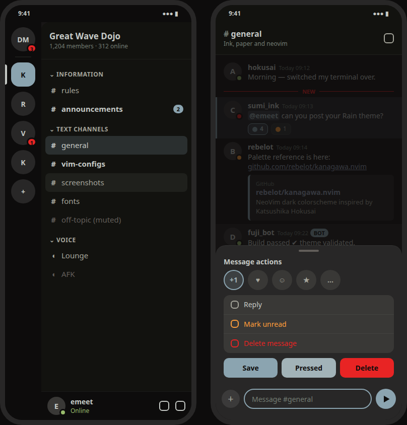

```
https://raw.githubusercontent.com/alpine-vortex/rain-themes/main/kanagawa-dragon/kanagawa-dragon.json
```
[Notes](kanagawa-dragon/kanagawa-dragon-notes.md) · [Spec](kanagawa-dragon/theme.spec.json)

<a id="kanagawa-wave"></a>
## Kanagawa Wave

*Wave (default dark) · accent: crystalBlue*

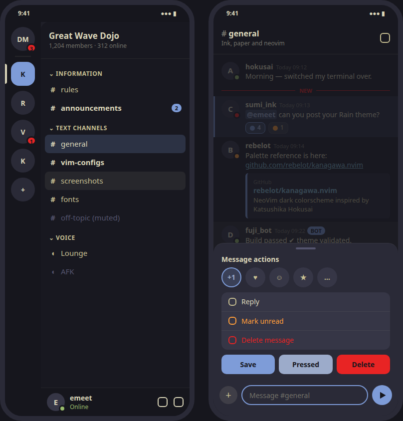

```
https://raw.githubusercontent.com/alpine-vortex/rain-themes/main/kanagawa-wave/kanagawa-wave.json
```
[Notes](kanagawa-wave/kanagawa-wave-notes.md) · [Spec](kanagawa-wave/theme.spec.json)

<a id="librekai"></a>
## Librekai

*Classic Monokai · accent: pink*

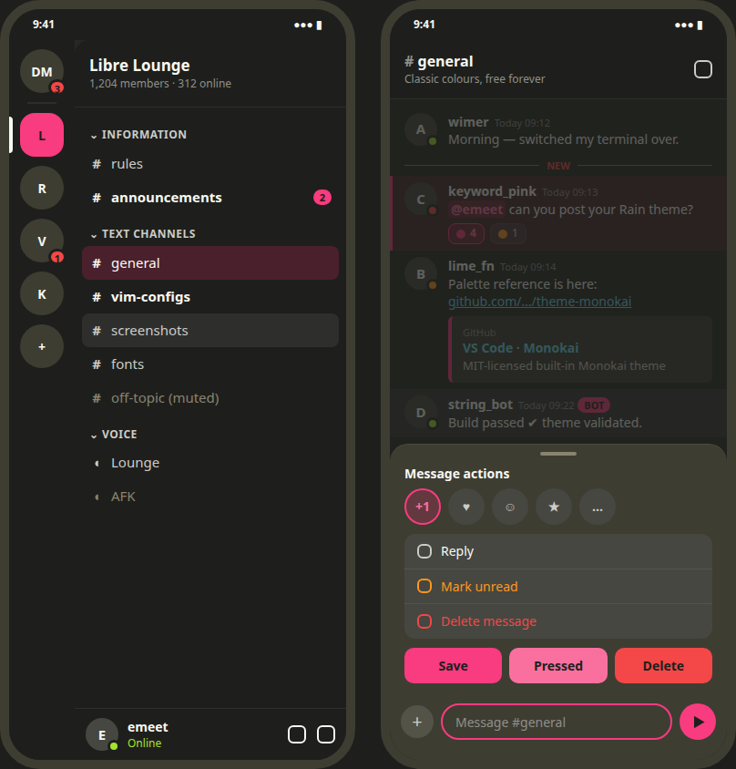

```
https://raw.githubusercontent.com/alpine-vortex/rain-themes/main/librekai/librekai.json
```
[Notes](librekai/librekai-notes.md) · [Spec](librekai/theme.spec.json)

<a id="librekai-dimmed"></a>
## Librekai Dimmed

*Monokai Dimmed · accent: amber*

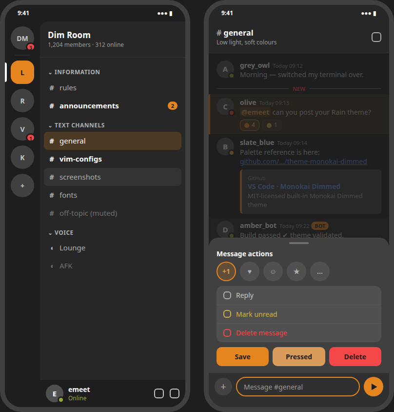

```
https://raw.githubusercontent.com/alpine-vortex/rain-themes/main/librekai-dimmed/librekai-dimmed.json
```
[Notes](librekai-dimmed/librekai-dimmed-notes.md) · [Spec](librekai-dimmed/theme.spec.json)

<a id="librekai-refined"></a>
## Librekai Refined

*Refined Monokai · accent: aqua*

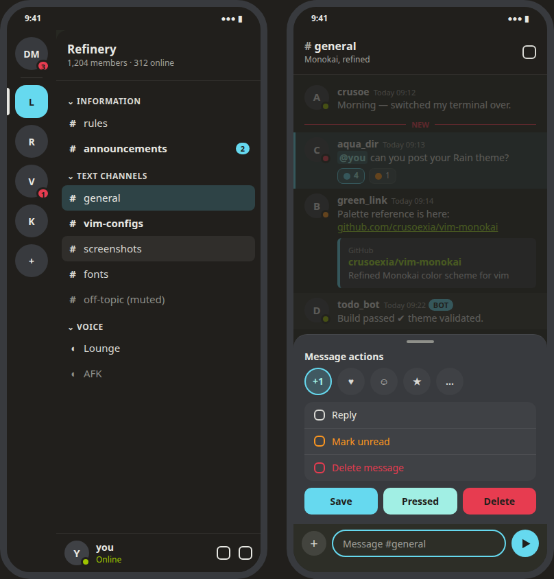

```
https://raw.githubusercontent.com/alpine-vortex/rain-themes/main/librekai-refined/librekai-refined.json
```
[Notes](librekai-refined/librekai-refined-notes.md) · [Spec](librekai-refined/theme.spec.json)

<a id="nord-frost"></a>
## Nord Frost

*Polar Night · bright nord8 Frost accent*

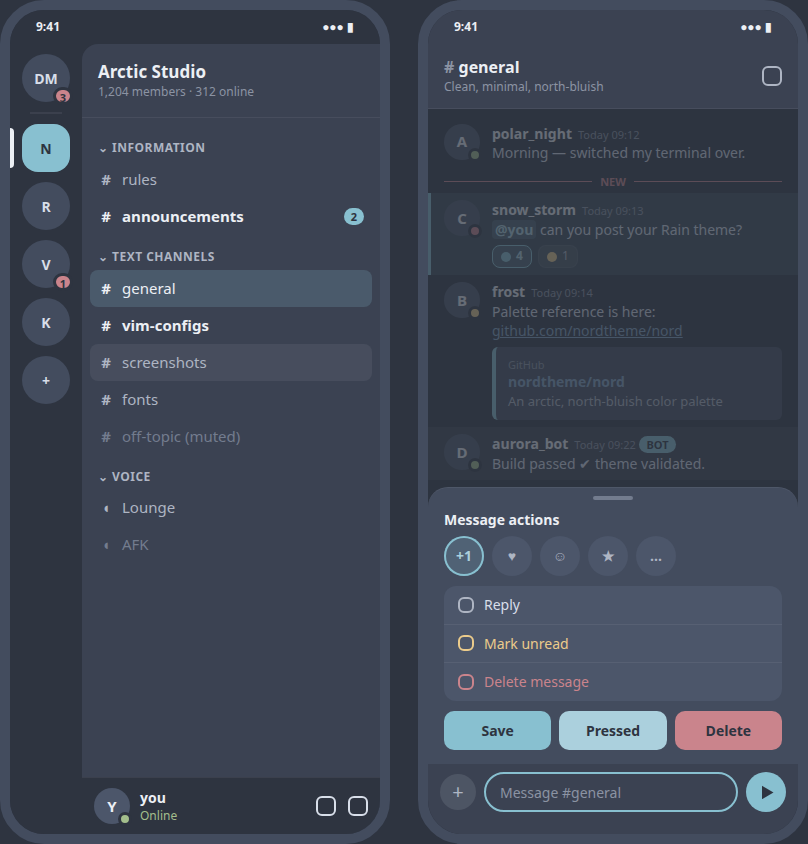

```
https://raw.githubusercontent.com/alpine-vortex/rain-themes/main/nord-frost/nord-frost.json
```
[Notes](nord-frost/nord-frost-notes.md) · [Spec](nord-frost/theme.spec.json)

<a id="nord-polar-night"></a>
## Nord Polar Night

*Polar Night · quiet nord9 accent*

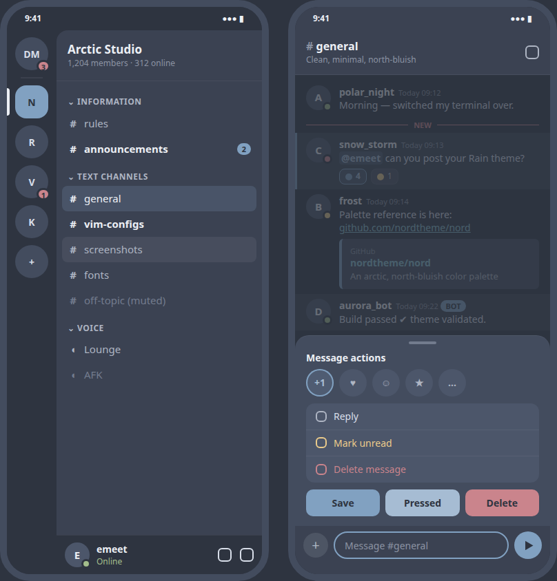

```
https://raw.githubusercontent.com/alpine-vortex/rain-themes/main/nord-polar-night/nord-polar-night.json
```
[Notes](nord-polar-night/nord-polar-night-notes.md) · [Spec](nord-polar-night/theme.spec.json)

<a id="rose-pine"></a>
## Rosé Pine

*Main (default dark) · accent: iris*

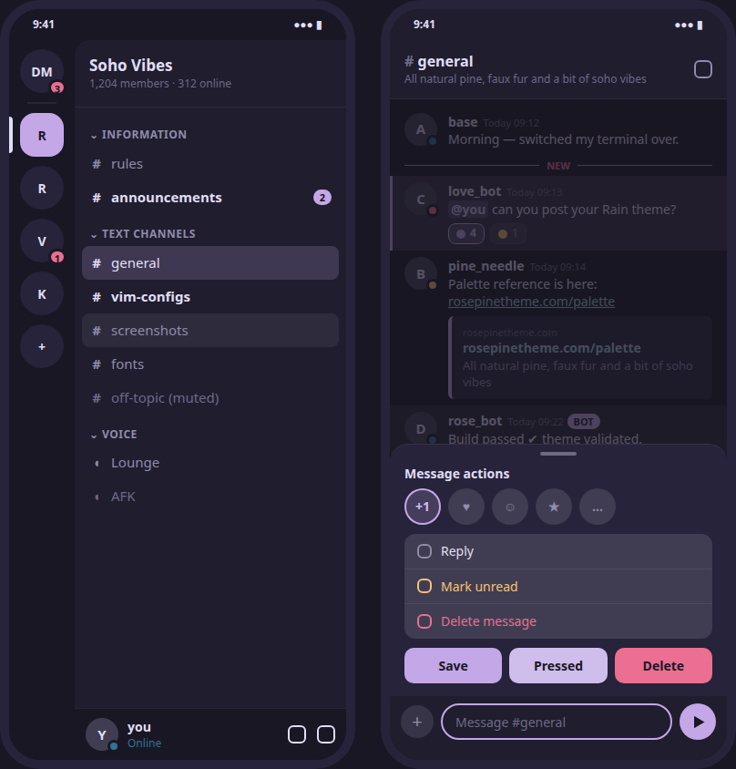

```
https://raw.githubusercontent.com/alpine-vortex/rain-themes/main/rose-pine/rose-pine.json
```
[Notes](rose-pine/rose-pine-notes.md) · [Spec](rose-pine/theme.spec.json)

<a id="rose-pine-moon"></a>
## Rosé Pine Moon

*Moon · accent: iris*

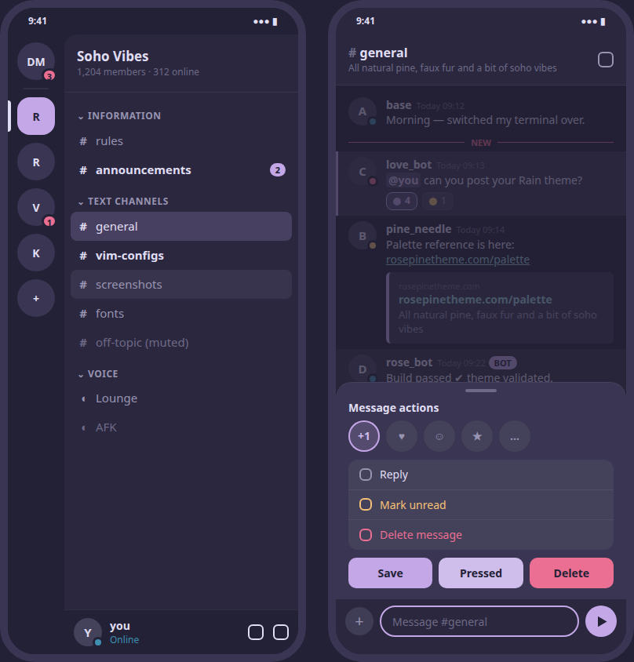

```
https://raw.githubusercontent.com/alpine-vortex/rain-themes/main/rose-pine-moon/rose-pine-moon.json
```
[Notes](rose-pine-moon/rose-pine-moon-notes.md) · [Spec](rose-pine-moon/theme.spec.json)

<a id="solarized-osaka"></a>
## Solarized Osaka

*Default dark style · accent: Solarized blue*

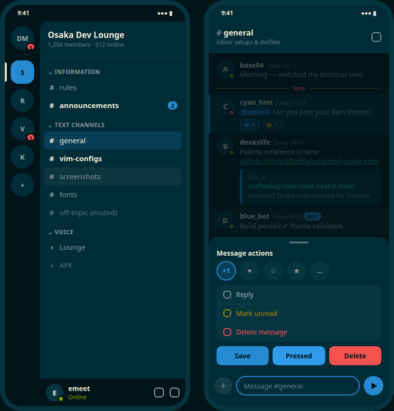

```
https://raw.githubusercontent.com/alpine-vortex/rain-themes/main/solarized-osaka/solarized-osaka.json
```
[Notes](solarized-osaka/solarized-osaka-notes.md) · [Spec](solarized-osaka/theme.spec.json)

<a id="tokyodark"></a>
## Tokyo Dark

*Default (gamma 1.0) · accent: blue*

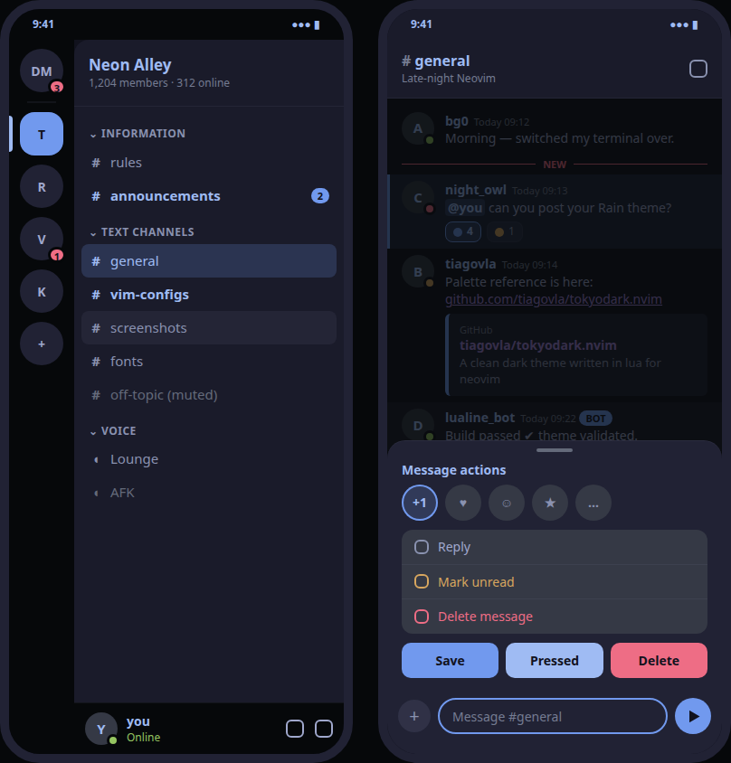

```
https://raw.githubusercontent.com/alpine-vortex/rain-themes/main/tokyodark/tokyodark.json
```
[Notes](tokyodark/tokyodark-notes.md) · [Spec](tokyodark/theme.spec.json)

<a id="tokyonight-moon"></a>
## Tokyo Night Moon

*Moon style · accent: blue*

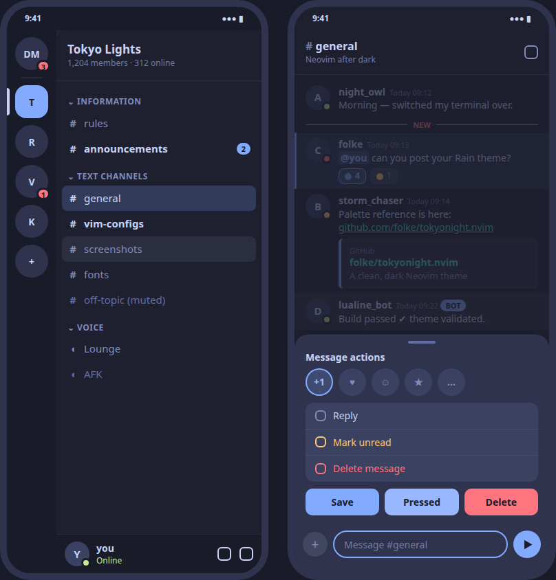

```
https://raw.githubusercontent.com/alpine-vortex/rain-themes/main/tokyonight-moon/tokyonight-moon.json
```
[Notes](tokyonight-moon/tokyonight-moon-notes.md) · [Spec](tokyonight-moon/theme.spec.json)

<a id="tokyonight-night"></a>
## Tokyo Night Night

*Night style · accent: blue*

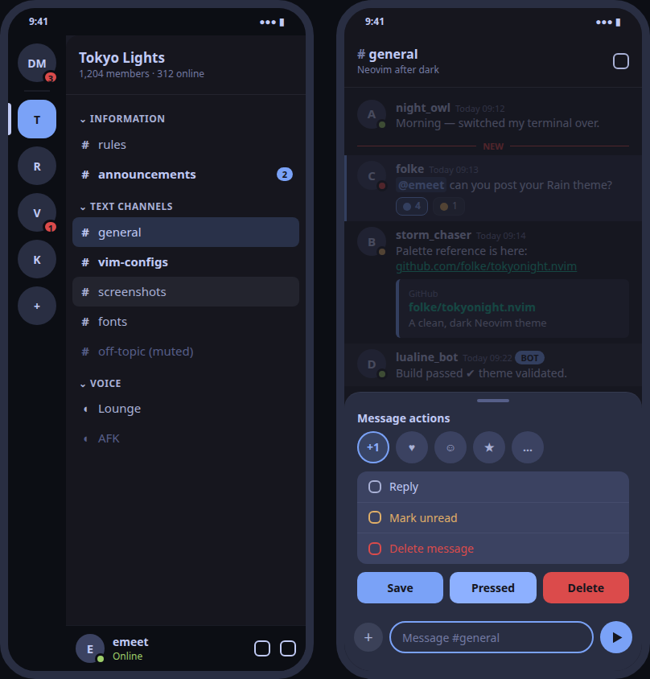

```
https://raw.githubusercontent.com/alpine-vortex/rain-themes/main/tokyonight-night/tokyonight-night.json
```
[Notes](tokyonight-night/tokyonight-night-notes.md) · [Spec](tokyonight-night/theme.spec.json)

<a id="tokyonight-storm"></a>
## Tokyo Night Storm

*Storm style · accent: blue*

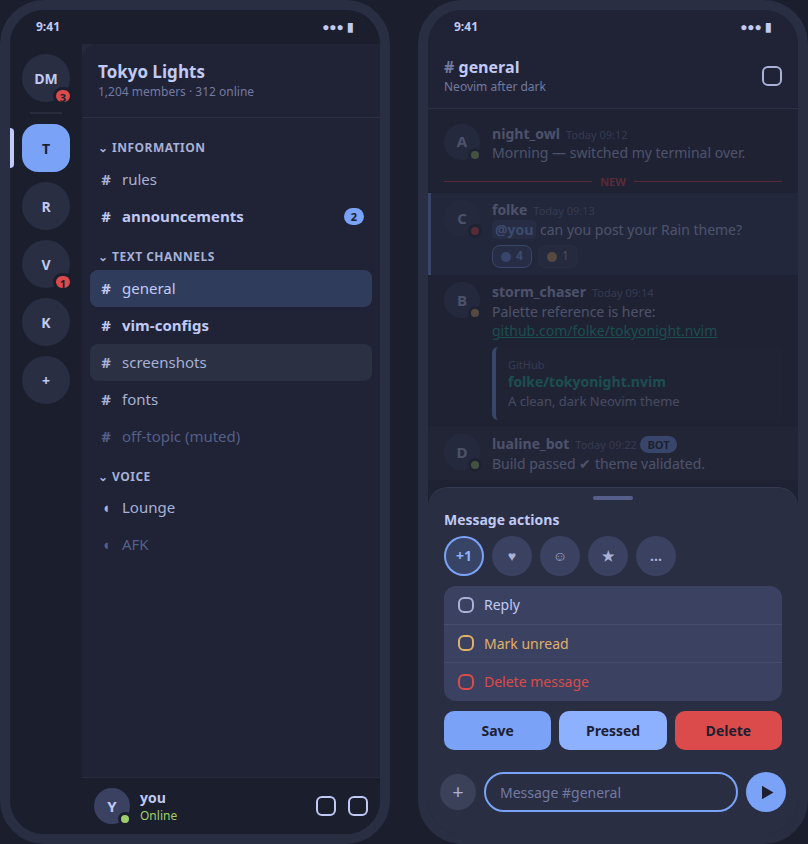

```
https://raw.githubusercontent.com/alpine-vortex/rain-themes/main/tokyonight-storm/tokyonight-storm.json
```
[Notes](tokyonight-storm/tokyonight-storm-notes.md) · [Spec](tokyonight-storm/theme.spec.json)
